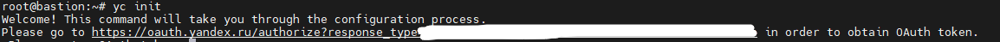
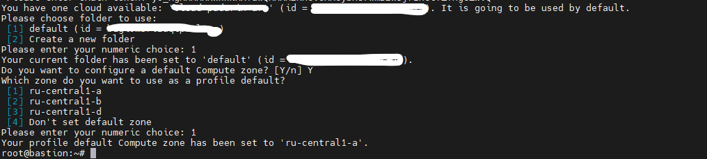
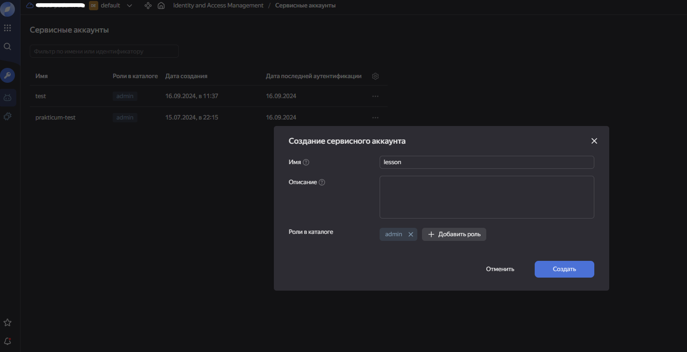
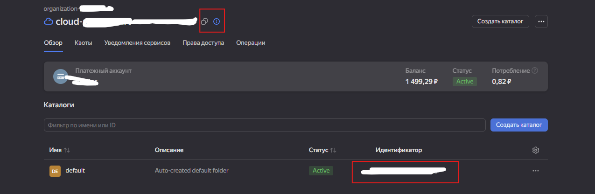
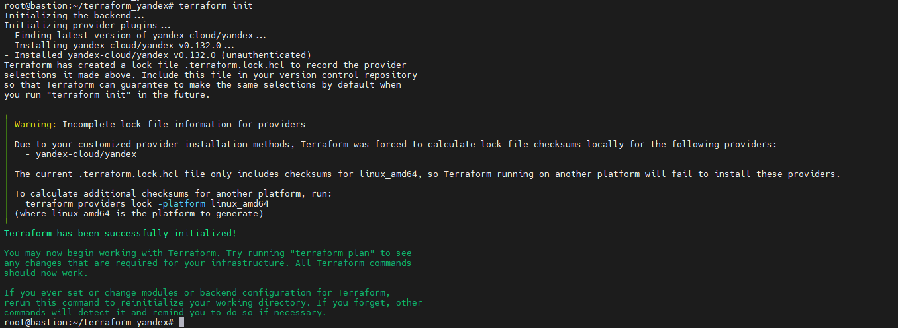

### Настройка хоста с Terraform

Разворачиваем любую ВМ где угодно с любым дистрибутивом. Далее необходимо установить пакеты:
- wget
- curl
- unzip

Теперь устанавливаем **Terraform** v1.12.0

```
wget https://hashicorp-releases.yandexcloud.net/terraform/1.12.0/terraform_1.12.0_linux_amd64.zip && unzip terraform_1.12.0_linux_amd64.zip -d /usr/bin 
```

Ставим утилиты яндекса [команда из документации](https://yandex.cloud/ru/docs/tutorials/infrastructure-management/terraform-quickstart#linux_1)
```
curl -sSL https://storage.yandexcloud.net/yandexcloud-yc/install.sh | bash 
```

Копируем в `/usr/bin` яндексовские утилиты для взаимодействия с облаком
```
cp yandex-cloud/bin/* /usr/bin/ 
```

Инициализируемся
```
yc init 
```

Эта команда нам выведит ссылку. Открываем ее в браузере и копируем токен, который вставляем в консоль машины



Дефолтными значениями отвечаем на все вопросы в консоли и успешно инициализируемся



Шагаем обратно в https://console.yandex.cloud/ и делаем следующее:

- Сверху выбераем раздел «Сервисные аккаунты»
- Создаем новый аккаунт с любым именем и ролью admin. Для этого кликаем на троеточие в правом верхнем углу → «Создать сервисный аккаунт»
- Нажимаем на созданную учётную запись
- Копируем ID в блокнот



Открываем с nano `~/.terraformrc` и вписываем:
```
provider_installation {
  network_mirror {
    url = "https://terraform-mirror.yandexcloud.net/"include = ["registry.terraform.io/*/*"]
  }
  direct {
    exclude = ["registry.terraform.io/*/*"]
  }
} 
```

Так мы описали стратегию для установки провайдеров в систему. Тут мы сказали что теперь провайдеры берутся из `https://terraform-mirror.yandexcloud.net/` и заменили дефолтную ссылку, чтобы тераформ не пытался скачивать провайдеры из своего репозитория. `direct->exclude` означает исключение стандартных значений

Создаем ключ авторизации для провайдера:
```
yc iam key create \
  --service-account-id <id аккаунта, который вставили в блокнот из шага выше> \
  --folder-name default \
  --output key.json 
```

Опять идем в https://console.yandex.cloud/ и делаем следующее:
- Жмем на имя облака — оно начинается с cloud-.
- Рядом с ним появится ID, который нужно скопировать и вставить в блокнот.
- Кликаем на имя каталога под названием облака — сохраняем и его ID в блокнот.



По очереди выполняем команды и записываем их себе куда угодно, потому что при перезагрузке ВМ настройки слетят и придется выполнять их по-новой:

```
yc config profile create <любое имя профиля>
yc config set service-account-key key.json
yc config set cloud-id <ID облака>
yc config set folder-id <ID каталога>
    
export YC_TOKEN=$(yc iam create-token) 
export YC_CLOUD_ID=$(yc config get cloud-id)
export YC_FOLDER_ID=$(yc config get folder-id) 
```

Настраиваем провайдер. Для этого создадим новый каталог с любым именем и перейдем в него, после чего создаем файл `providers.tf`

```
mkdir ~/terraform_yandex && cd ~/terraform_yandex && touch providers.tf
```

Теперь в `providers.tf` вписываем:

```
terraform {
  required_providers {
    yandex = {
      source = "yandex-cloud/yandex"
    }
  }
  required_version = ">= 0.13"
}

provider "yandex" {
  zone = "ru-central1-b"
}
```

Проверяем что все окей:
```
terraform init
```

Если все ок, то видим следующее:



### Начинаем описывать инфраструктуру

У тераформа есть несколько очень важных файлов:

1. providers.tf - настройка провайдера, то что мы уже сделали
2. variables.tf - тут хранятся только дефолтные значения, которые можно переписать в других фалах 
3. terraform.tfvars - тоже файлы с переменными. Они используются для перезаписи из variables.tf
4. output.tf - в нем описывается что должно отобразиться в консоли после выполнения действий с инф-рой
5. main.tf - что будет делать терраформ

Начнем с `variables.tf`. Стандартно в нашей инфре нет машин и сетей

```hcl
variable "virtual_machines" {
 default = ""
}

variable "subnets" {
 default = ""
}
```

Всю инфраструктуру мы будем описывать в terraform.tfvars. Создадим файл `terraform.tfvars` и впишем:

```
# Переопределяем переменную для описания подсетей, которые будут созданы. Эта же переменная есть в variables.tf
subnets = {
  "s-1" = {
    name = "sub-1"
    zone = "ru-central1-a"
    v4_cidr_blocks = ["192.168.20.0/24"]
  }
}

# Переопределяем переменную для описания машин, которые будут созданы. Эта же переменная есть в variables.tf. Все названия переменных внутри virtual_machines - произвольные и нужны для динамического создания машин
virtual_machines = {
    "vm-1" = {
      vm_name       = "machine-1" # Имя ВМ
      vm_desc       = "Описание для нас. Его видно только здесь" # Описание
      vm_cpu        = 2 # Кол-во ядер процессора
      ram           = 2 # Оперативная память в ГБ
      disk          = 10 # Объем диска в ГБ
      disk_name     = "machine-1-disk" # Название диска
      template      = "fd85bll745cg76f707mq" # ID образа ОС для использования
      public_ip     = true
      managed       = true
      zone          = "ru-central1-a"
      disk_type     = "network-hdd"
      core_fraction = 20
      platform_id   = "standard-v3"
      subnet        = "s-1"
    },
    "vm-2" = {
      vm_name      = "machine-2" # Имя ВМ
      vm_desc      = "Описание для инженеров. Его видно только здесь"
      vm_cpu       = 2 # Кол-во ядер процессора
      ram          = 2 # Оперативная память в ГБ
      disk         = 10 # Объем диска в ГБ
      disk_name    = "machine-2-disk" # Название диска
      template     = "fd85bll745cg76f707mq" # ID образа ОС для использования
      public_ip    = true
      managed      = true
      zone         = "ru-central1-b"
      disk_type    = "network-hdd"
      core_fraction = 20
      platform_id   = "standard-v3"
      subnet        = "s-1"
    },
    "vm-3" = {
      vm_name      = "machine-3" # Имя ВМ
      vm_desc      = "Описание для инженеров. Его видно только здесь"
      vm_cpu       = 2 # Кол-во ядер процессора
      ram          = 2 # Оперативная память в ГБ
      disk         = 20 # Объем диска в ГБ
      disk_name    = "machine-3-disk" # Название диска
      template     = "fd85bll745cg76f707mq" # ID образа ОС для использования
      public_ip    = false
      managed      = true
      zone         = "ru-central1-a"
      disk_type    = "network-hdd"
      core_fraction = 20
      platform_id   = "standard-v3"
      subnet        = "s-1"
    }
}
```

Создаем файл ``main.tf`` с содержимым:

```hcl
resource "yandex_compute_disk" "boot-disk" {
  for_each = var.virtual_machines
  name     = each.value["disk_name"]
  type     = each.value["disk_type"]
  zone     = each.value["zone"]
  size     = each.value["disk"]
  image_id = each.value["template"]
}

resource "yandex_vpc_network" "network-1" {
  name = "network-1"
}

resource "yandex_vpc_subnet" "subnet" {
  for_each       = var.subnets
  name           = each.value["name"]
  zone           = each.value["zone"]
  network_id     = yandex_vpc_network.network-1.id
  v4_cidr_blocks = each.value["v4_cidr_blocks"]
}

resource "yandex_compute_instance" "virtual_machine" {
  for_each        = var.virtual_machines
  name = each.value["vm_name"]
  zone = each.value["zone"]
  allow_stopping_for_update = true

  platform_id = each.value["platform_id"]
  resources {
    cores  = each.value["vm_cpu"]
    memory = each.value["ram"]
    core_fraction = each.value["core_fraction"]
  }

  boot_disk {
    disk_id = yandex_compute_disk.boot-disk[each.key].id
  }

  network_interface {
    subnet_id = yandex_vpc_subnet.subnet[each.value.subnet].id
    nat       = each.value["public_ip"]
  }

  metadata = {
    ssh-keys = "<логин пользователя для подключения по ssh>:${file("~/.ssh/id_ed25519.pub")}"
  }
}
```

Все описанные выше значения в файле `main.tf` берутся из [официальной документации](https://yandex.cloud/ru/docs/tutorials/infrastructure/coi-with-terraform) к провайдеру. Не забудьте изменить логин пользователя в `metadata`. 

Из интересного только то что используется `for_each`, внутри которого перебираются переменные. Пример - `each.value["vm_name"]`, то есть из переменной `virtual_machines` забирается значение с ключом `vm_name` (см. terraform.tfvars)

Остается только создать новую пару ssh-ключей командой `ssh-keygen -t ed25519`. Проверить все командой `terraform plan` и создать машины и подсети с помощью `terraform apply`

### Настройка хоста с Terraform. Устанавливаем Ansible

Создаем файл `ansible.cfg` с содержимым:

```
[defaults]
host_key_checking = false 
```

Так мы отключили проверку ссш ключей. Теперь создаем файл инвентарь. Имя может быть любым, главное правильно описать `yaml` формат:

```
linux:
  children:
    nginx_proxy:
      hosts:
        <имя машины>-proxy:
          ansible_host: <адрес машины>
    nginx_custom:
      hosts:
        <имя машины>-custom:
          ansible_host: <адрес машины>
        <имя машины>-custom:
          ansible_host: <адрес машины>
  vars:
    ansible_user: "<юзер из тераформа>"
    connection_protocol: ssh #тип подключения
    ansible_become: true #Становиться ли другим пользователем после подключения
    ansible_ssh_private_key_file: ~/.ssh/id_ed25519
```

Создаем теперь плейбук `playbook.yaml`:

```
- name: Установка стандартных пакетов
  hosts: all
  roles:
    - role: host_setup
  tags:
    - host_setup
    
- name: Установка и настройка nginx c кастомной страницей
  hosts: nginx
  roles:
    - role: nginx_custom
  tags:
    - nginx_custom

- name: Установка и настройка проксирующего nginx
  hosts: nginx
  roles:
    - role: nginx_proxy
  tags:
    - nginx_proxy
```

Создадим роли
```
ansible-galaxy init host_setup
ansible-galaxy init nginx_custom
ansible-galaxy init nginx_proxy
```

Создаем задачи по установке пакетов

`nano host_setup/tasks/main.yml`

```
- name: Меняем имя машины
  shell: "echo {{ inventory_hostname }} > /etc/hostname"
  when: "inventory_hostname != ansible_hostname"

- name: Установка программ #Имя задачи
  apt: #Используемый модуль
    name: "{{ item }}" #Имя пакета из цикла
    state: present #Параметр действия. present - установить, absent - удалить
  loop:
    - "{{ packages_to_install }}" #Цикл будет перебирать все значения из переме>

- name: Установка Nginx
  apt:
    name: "nginx"
    state: present
```

Создаем переменную со списком пакетов:
`nano host_setup/vars/main.yml`

```
packages_to_install:
  - dnsutils
  - net-tools
  - rsync
  - mc
  - curl
  - wget
  - nginx
```

Создадим задачи и шаблон по настройке Nginx с кастомной страницей

``nano nginx_custom/tasks/main.yml``

```
- name: Подмена веб-страницы
  ansible.builtin.template:
    src: index.j2
    dest: /var/www/html/index.nginx-debian.html
  notify: "Nginx Reloader"
  when: "'custom' in inventory_hostname" #Выполняем только на машинах, где в имени есть custom
```

`nano nginx_custom/handlers/main.yml`

```
# handlers file for nginx_custom
- name: Nginx Reloader
  ansible.builtin.service:
    name: nginx
    state: restarted
    enabled: yes
  listen: "Nginx Reloader"
```

``nano nginx_custom/templates/main.j2``

```

<body>
<p><center><b>Hello from {{ inventory_hostname }}!</b></center></p>
</body>

```

Создадим задачи и шаблон по настройке proxy Nginx

``nano nginx_proxy/tasks/main.yml``

```
- name: Подмена веб-страницы
  ansible.builtin.template:
    src: nginx.j2
    dest: /etc/nginx/nginx.conf
  notify: "Nginx Reloader"
  when: "'proxy' in inventory_hostname" #Выполняем только на машинах, где в имени есть proxy
```

`nano nginx_proxy/handlers/main.yml`

```
# handlers file for nginx_proxy
- name: Nginx Reloader
  ansible.builtin.service:
    name: nginx
    state: restarted
    enabled: yes
  listen: "Nginx Reloader"
```

``nano nginx_proxy/templates/nginx.j2``

```
user www-data;
worker_processes auto;
pid /run/nginx.pid;
include /etc/nginx/modules-enabled/*.conf;

events {
        worker_connections 768;
        # multi_accept on;
}

http {

       upstream <имя апстрима> {
          server <адрес сервера №1>:80 weight=1;
          server <адрес сервера №2>:80 weight=1;
       }
       server {
          listen 3000;
          location / {
             proxy_pass http://<имя апстрима>;
          }
       }
        ##
        # Basic Settings
        ##

        sendfile on;
        tcp_nopush on;
        types_hash_max_size 2048;
        # server_tokens off;

        # server_names_hash_bucket_size 64;
        # server_name_in_redirect off;

        include /etc/nginx/mime.types;
        default_type application/octet-stream;

        ##
        # SSL Settings
        ##

        ssl_protocols TLSv1 TLSv1.1 TLSv1.2 TLSv1.3; # Dropping SSLv3, ref: POODLE
        ssl_prefer_server_ciphers on;

        ##
        # Logging Settings
        ##

        access_log /var/log/nginx/access.log;
        error_log /var/log/nginx/error.log;

        ##
        # Gzip Settings
        ##

        gzip on;


        include /etc/nginx/conf.d/*.conf;
        include /etc/nginx/sites-enabled/*;
}

```

В шаблоне выше не забываем изменить имя апстрима и адрес серверов

Запускаем ансибл
```
ansible-playbook -i <файл инвентарник> playbook.yaml
```